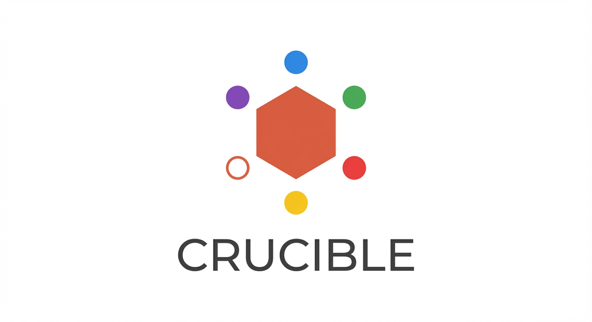
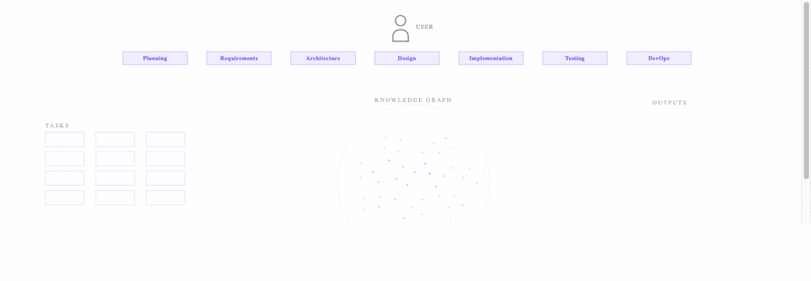
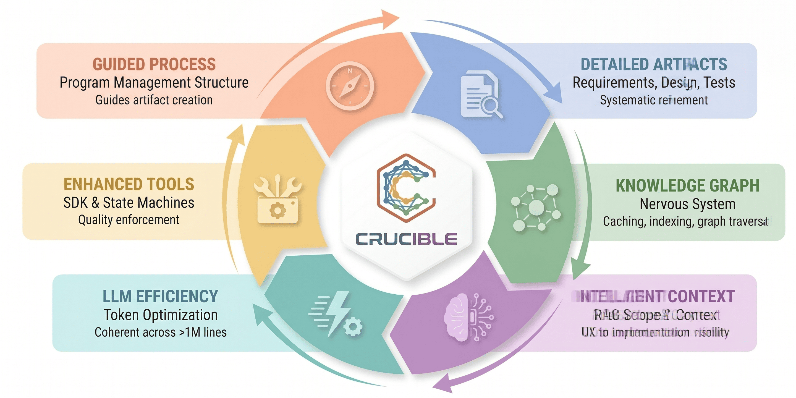

  

<h1 align="center">Crucible</h1>

  <strong>The orchestrated AI dev team that learns as you build.</strong>

  13 AI personas collaborate through your full software development lifecycle — planning, requirements, design, implementation, testing, deployment — inside VS Code with Claude Code. Task management, knowledge graph, quality gates, and structured handoffs.

  
  
  
  
  
  

  <a href="https://crucible.emberagenticlabs.com/#access"><strong>Request Access (Private Beta)</strong></a>&nbsp;&nbsp;|&nbsp;&nbsp;<a href="https://crucible.emberagenticlabs.com">Website</a>

  <a href="docs/getting-started.md">Getting Started</a> · <a href="docs/demo-walkthrough.md">Demo Walkthrough</a> · <a href="docs/best-practices.md">Best Practices</a>

  <a href="#how-it-works">How It Works</a> · <a href="#whos-it-for">Who It's For</a> · <a href="#get-access">Get Access</a> · <a href="#support">Support</a>

---

  

---

### Existence proof

**Crucible was built using Crucible.** The knowledge graph forms a connective network across requirements, designs, code, tests, and decisions. These numbers come from the production graph, queryable today.

| 12,000 | 28,000 | 6,500 | 13x |
|:------:|:------:|:-----:|:---:|
| linked artifacts | typed edges | atomic tasks | the scope of my last solo project |

---

### How it works

**A virtuous cycle, every loop.**

Guided process produces detailed artifacts. Artifacts populate the knowledge graph. The graph powers intelligent context for the next agent. Better context drives LLM efficiency. Efficiency lets the toolset do more. Each rotation sharpens the next.

A 100K-line project starts from the same place as a 10K-line one — because the substrate carries forward, not the chat window.

*Every cycle reuses what the last one captured. The system compounds — sharper with every task, never starting from zero.*

  

---

### Coordination

**Agent deliverables, coordinated through task management.**

Each task carries explicit acceptance criteria, a designated agent, and a tracked deliverable. As tasks complete, the system hands artifacts forward — every handoff recorded, every deliverable verifiable.

*Project state stays explicit. What's in flight, what's blocked, which deliverable is missing — visible at a glance.*

  

---

### From intent to spec

**Turn fuzzy intent into a working spec.**

Crucible interviews you to surface ambiguity, then produces a real architecture spec — with Mermaid diagrams, design decisions, and acceptance criteria the next phase can actually execute against. Not a wishlist.

*Scope ambiguity caught at the cheapest moment, before code is written, instead of the most expensive — after implementation.*

  

---

### Governance

**Quality gates that guide agents to the right outputs at each stage.**

Each phase defines exactly what its deliverable should contain — design needs architecture decisions and atomic tasks; implementation needs linked specs and verified acceptance criteria; testing needs evidence. When something's missing, the agent gets told what to add and where it goes.

*Agents learn the standard from the system itself. Output arrives complete, ready for the next phase to act on directly.*

  

---

### Who's it for

**Good fit**
- Developers building multi-file projects in VS Code
- Codebases too large for a single AI conversation
- Work that benefits from structured handoffs and discoverable decisions
- Teams who want documented, tested output by default

**Not yet**
- Single-file scripts and prototypes
- One-shot ad-hoc work
- Projects without VS Code or Claude Code in the toolchain
- Want fully autonomous AI — Crucible is a partner, not an autopilot

---

### Crucible Alpha vs Pro

**Crucible Alpha** — *Available now*
Built on Claude Code. Single-LLM orchestration with full power and full risk.
- VS Code extension
- MCP-native task management
- Knowledge graph + persona workflows
- Quality gates between phases

**Crucible Pro** — *Coming*
Multi-LLM orchestration. Adaptive selection across providers for speed, cost, and quality.
- Multi-provider model orchestration
- Cost/quality routing per task
- Persistent sessions per persona
- Enterprise deployment options

---

## Get Access

Crucible is in **private beta**. Request access and you'll get an install link by email.

  <a href="https://crucible.emberagenticlabs.com/#access"><strong>→ Request Access</strong></a>

You'll need:
- **macOS** 11+, **Windows** 10+, or **Linux** (x64 / arm64)
- **VS Code**
- **Anthropic account** — [console.anthropic.com](https://console.anthropic.com)
- ~500 MB disk, 4 GB RAM

---

## Support

- Email: [support@emberagenticlabs.com](mailto:support@emberagenticlabs.com)
- Report issues: [GitHub Issues](https://github.com/ember-agentic/crucible/issues)
- Discussions: [GitHub Discussions](https://github.com/ember-agentic/crucible/discussions)
- Website: [crucible.emberagenticlabs.com](https://crucible.emberagenticlabs.com)

---

  Built by <a href="https://emberagenticlabs.com">Ember Agentic Labs</a>

