# Building a restaurant reservation system with Crucible.

From an idea to a running application -- a step-by-step walkthrough.

## The setup

**Meet Alex.** Alex is a developer building a restaurant reservation system for a mid-size restaurant -- 30 tables, lunch and dinner service. They currently use a paper book and phone calls, and they're constantly dealing with double-bookings and no-shows.

Alex has been using Claude Code for months and loves it for individual tasks. But this project has multiple components that need to work together -- authentication, a booking engine, a real-time dashboard, an API. Every time Alex tries to build something this complex with AI, the same thing happens: the first few files are great, then the AI starts contradicting earlier decisions and generating code that doesn't fit.

Alex installs Crucible.

## Step 01 -- Install: One command, full setup.

Alex runs one command in the terminal. It handles Node.js, the VS Code extension, and sets up a workspace with all the personas. Takes about a minute.

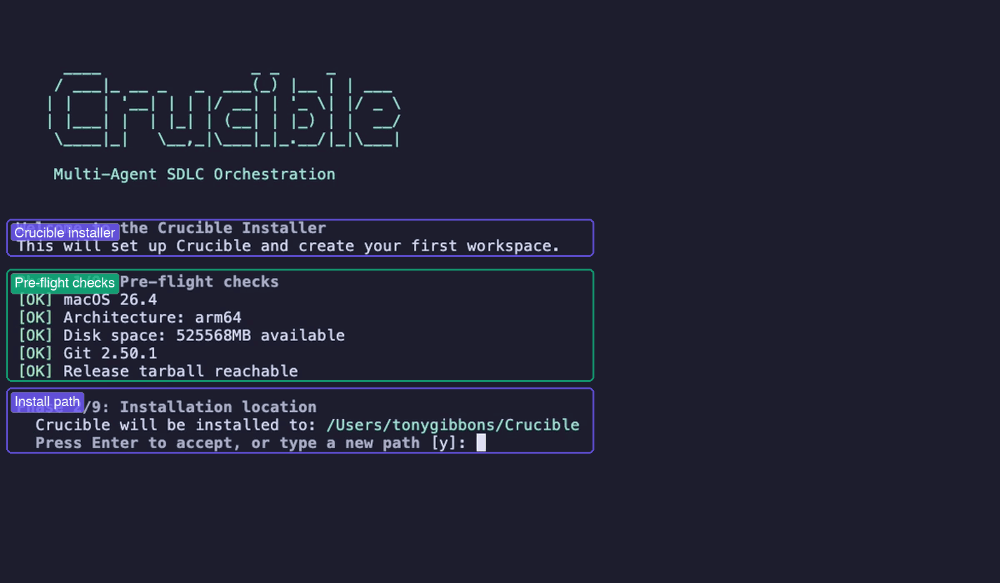

The installer runs through 9 phases -- pre-flight checks verify macOS, Node.js, disk space, and Git. Once the install path is configured, it handles the rest: VS Code extension, workspace creation, and a health check.

## Step 02 -- First look: A team waiting for a brief.

Alex opens VS Code and there's Crucible in the sidebar -- a list of AI personas, each with a specialty. Planning, Requirements, Architecture, Implementation, Testing.

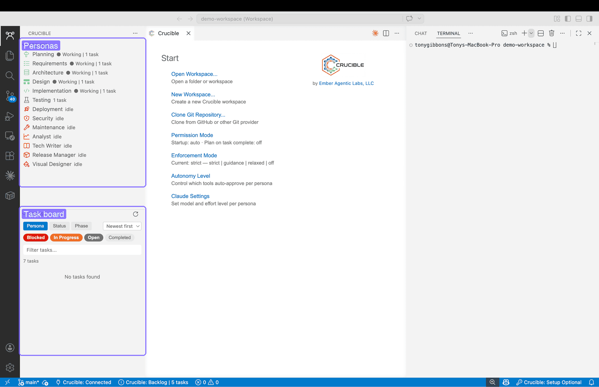

The sidebar shows all available personas. The task board is empty and ready. The terminal waits for a conversation.

## Step 03 -- Start with planning.

Alex clicks the Planning persona. A Claude Code terminal opens -- connected to Crucible's MCP server, with access to all the workflow tools.

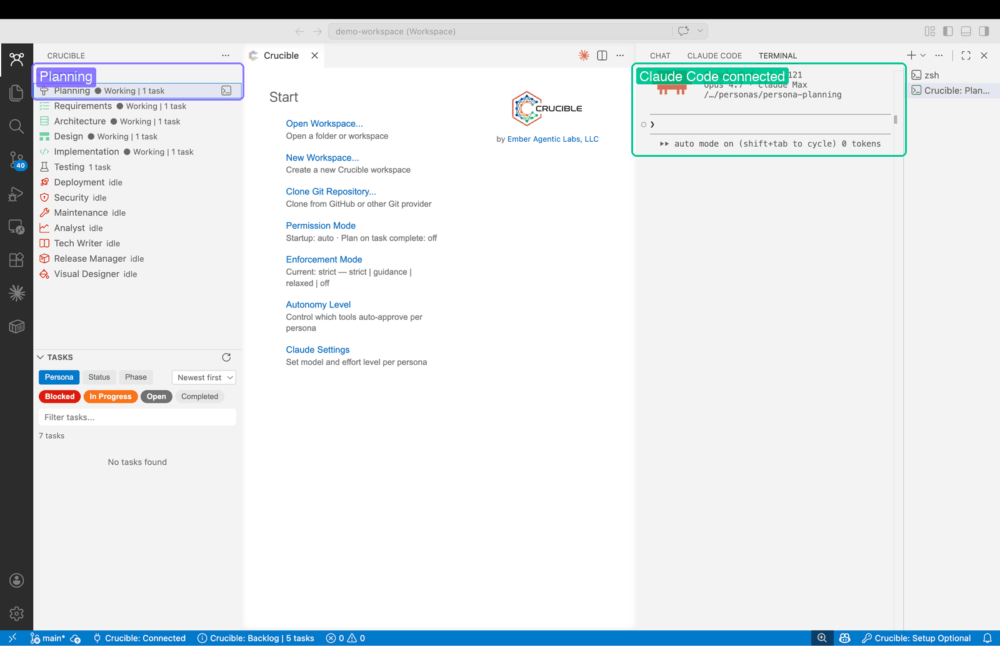

Each persona gets its own Claude Code session connected to Crucible's MCP server, with access to task creation, project structuring, and delegation tools.

## Step 04 -- Describe what you want.

Alex describes the restaurant, the problems they're having, and what needs to be built. No technology choices -- just the problem and the outcome.

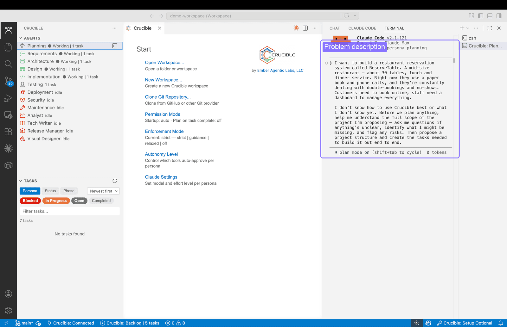

The prompt describes the problem and outcome, not the technology. "I don't know what I don't know yet. Before we plan anything, help me understand the full scope."

## Step 05 -- Discovery before planning.

Instead of jumping straight to task creation, the planner analyzes the problem space first -- phone bookings, hybrid migration risks, payment compliance, SMS costs. Then it asks the highest-leverage question: what's the target scope?

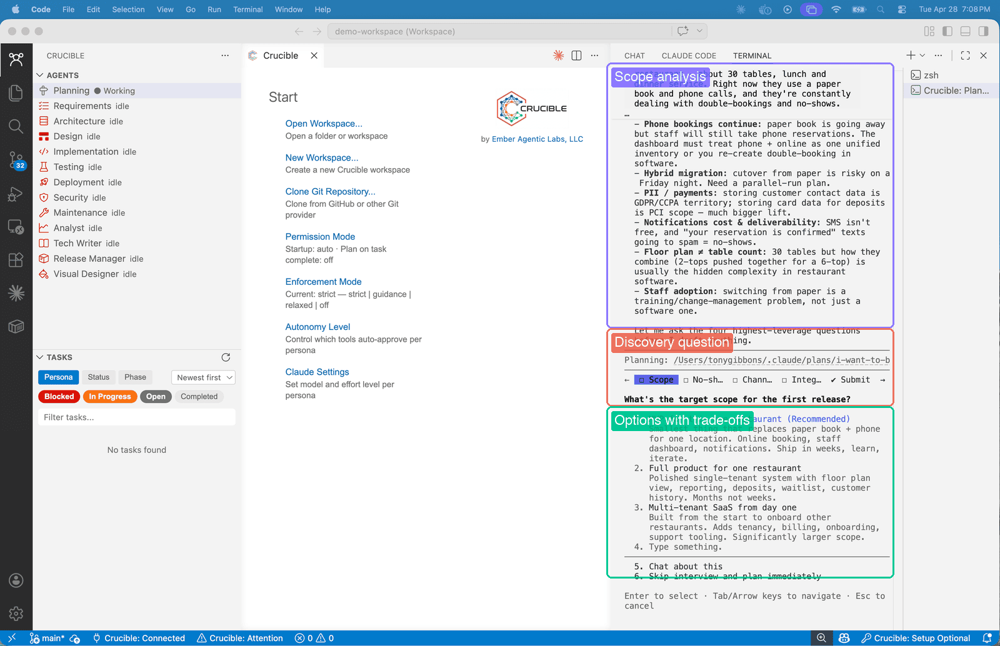

The planner asks the highest-leverage scoping question with concrete options: MVP in weeks, full product in months, or multi-tenant SaaS. Understand first, plan second.

## Step 06 -- Structured plan.

After discovery, the planner creates a project structure: 4 planning tracks running in parallel, 9 requirements clusters handed off to the Requirements persona, producing 44 user stories covering the full scope.

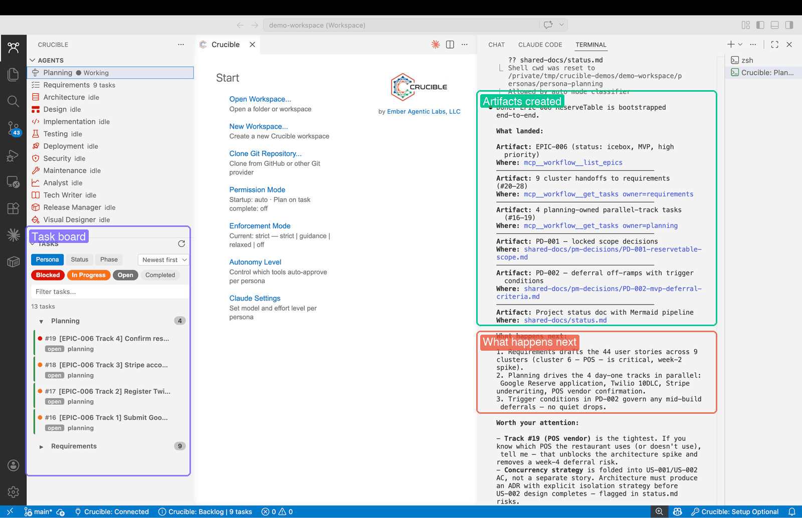

The task board fills up. 9 requirement clusters, 4 parallel planning tracks, 44 user stories. A structured decomposition with phases, dependencies, and delegation.

## Step 07 -- Live status.

Alex asks for a status report. It pulls live data -- a pipeline table showing which personas have work, what's signed off, what's blocked.

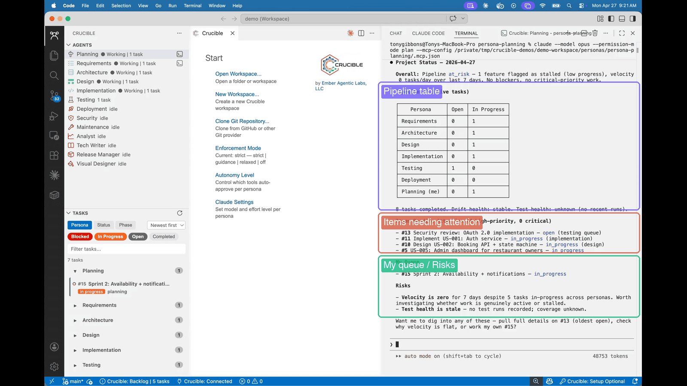

Live pipeline data from the MCP server -- task counts per persona, completion and signoff progress, and items needing attention flagged in red.

## Step 08 -- Governance in action.

The Requirements persona tries to hand off directly to Design, skipping Architecture. Crucible blocks it. The agent figures out the right path on its own.

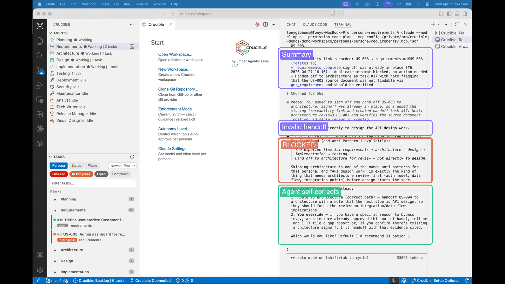

The pipeline flow is enforced: requirements -> architecture -> design -> implementation -> testing. The agent self-corrects and routes to Architecture. No human intervention needed.

## Step 09 -- Knowledge graph.

Before creating anything new, the Architecture persona searches the knowledge base. It finds existing requirements, checks for prior decisions, and builds on what's already there.

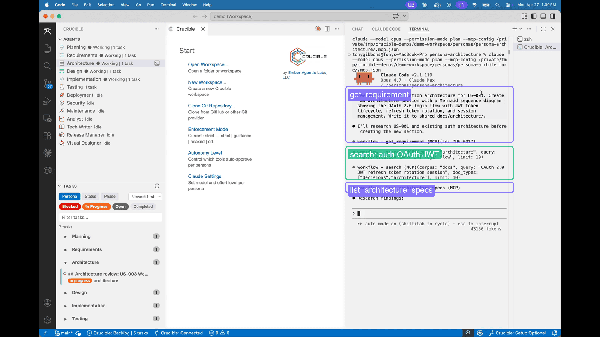

The agent searches before creating -- prior decisions inform future work. Every task adds to the knowledge graph, and every search uses it.

## Step 10 -- Architecture specs.

The Architecture persona creates a full spec with OAuth 2.0, PKCE, and JWT -- complete with a sequence diagram showing the entire login flow.

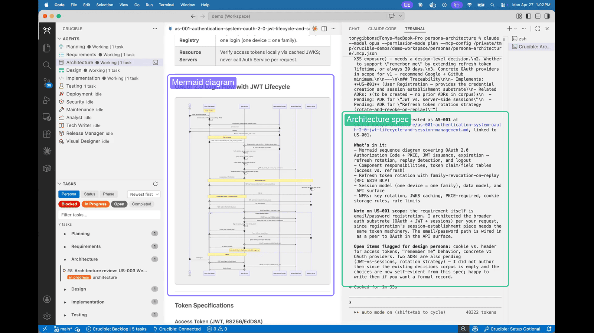

A rendered Mermaid sequence diagram showing the OAuth login flow -- created automatically as part of the architecture spec.

## Step 11 -- Implementation.

Implementation builds the React components following the design spec -- stat cards, booking table, availability chart. Building what was specified, linked back to the requirements.

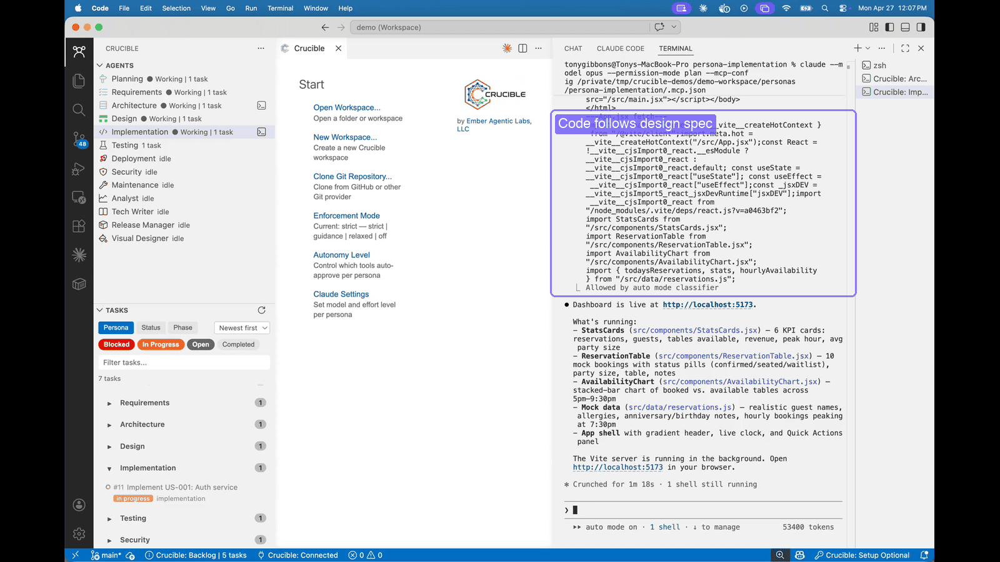

Code written in context -- React components following the design spec, with the implementation task linking back to the specs and requirements it implements.

## Step 12 -- The result.

Alex launches the dev server. A real dashboard -- live clock, KPI cards, booking table with status badges, availability chart. Built from a conversation, with requirements, architecture, and tests behind it.

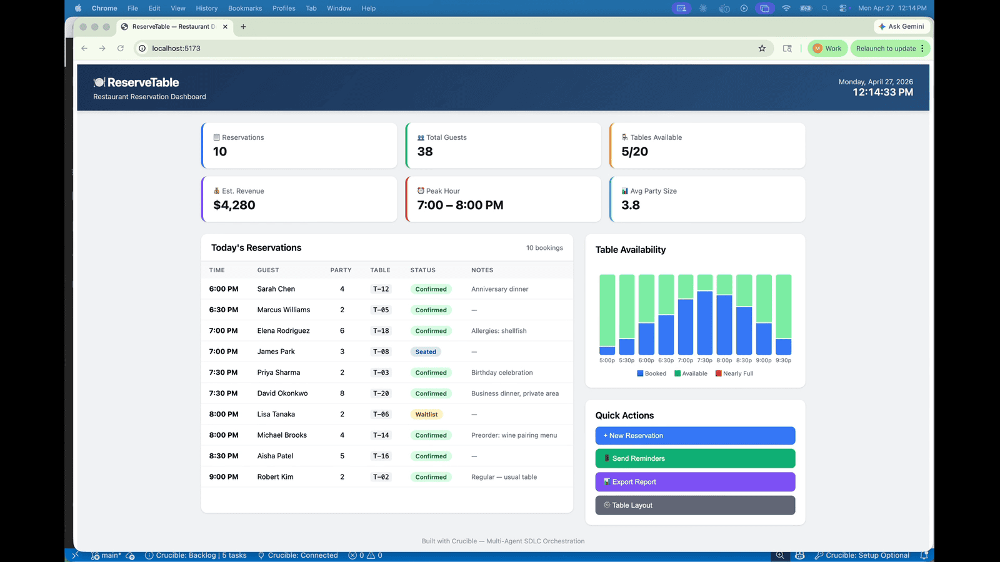

ReserveTable -- 10 reservations, 38 guests, 5/20 tables available, $4,280 revenue. Built with Crucible.

---

## AI as a structured development team.

Requirements flow to architecture, architecture to design, design to implementation -- with quality gates between phases, a growing knowledge graph, and full traceability at every step.

Nothing is forgotten. Nothing is skipped. Every decision compounds.
